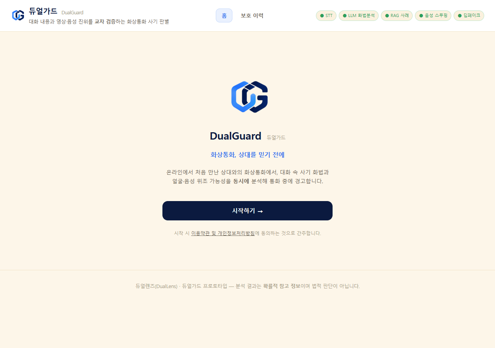
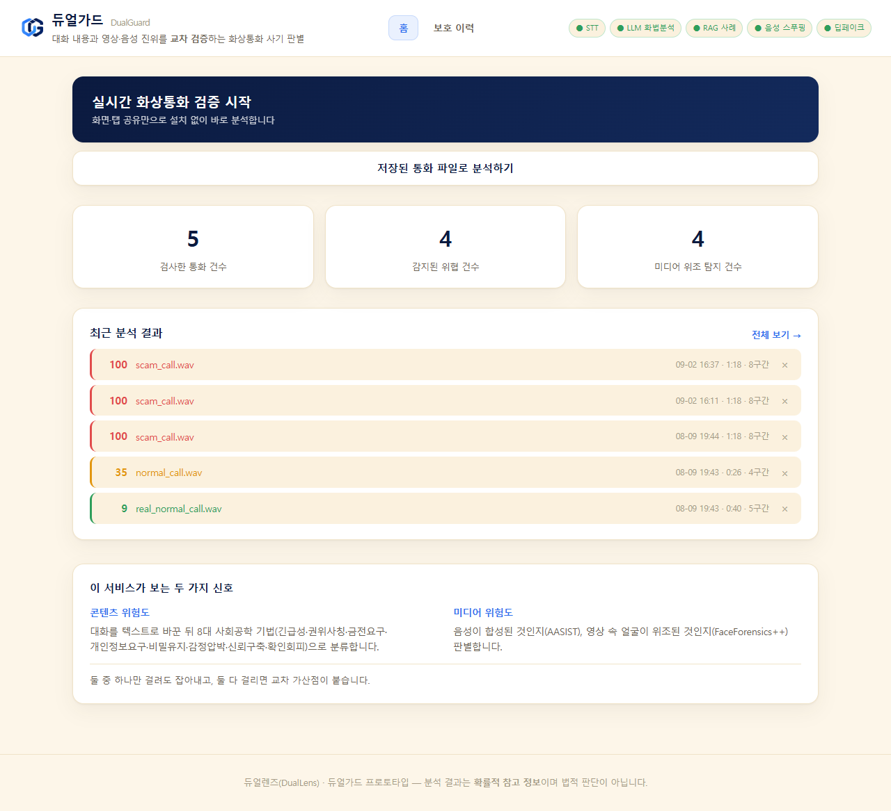
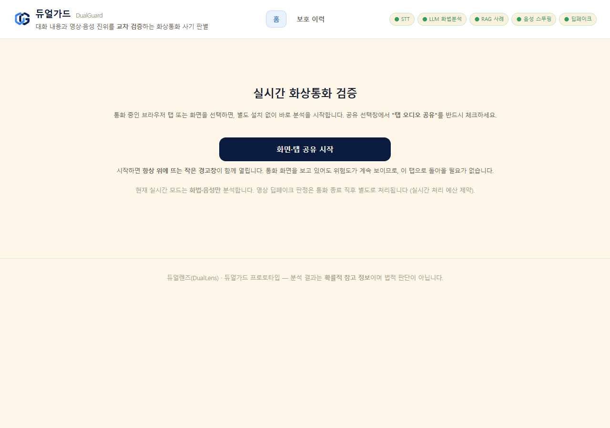
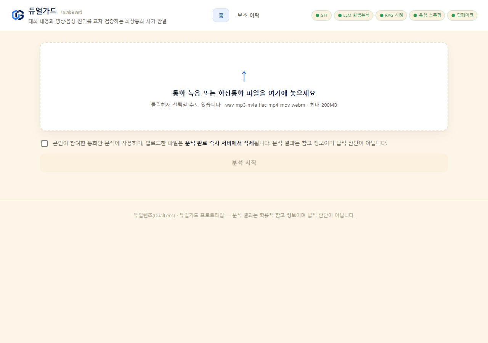
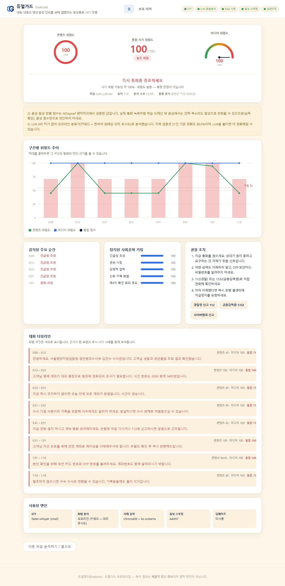

# 🛡 듀얼가드 (DualGuard)

> 화상통화 사기, 두 개의 눈으로 봅니다 — 화법 + 미디어 진위를 교차검증하는 실시간 통화 사기 탐지 AI

<br>

## 👀 서비스 소개

- **서비스명**: 듀얼가드 (DualGuard)
- **서비스 설명**: 온라인에서 처음 만난 상대와의 화상통화에서 **대화 화법**과 **음성·영상의 진위**를 동시에 분석해, 통화 도중에 위험을 경고하는 AI 서비스입니다. 브라우저 탭 공유만으로 설치 없이 시작하고, 항상 위에 떠 있는 경고창이 통화 화면 위에 위험도와 판단 근거를 실시간으로 표시합니다. STT → 8대 사회공학 기법 분류 → RAG 사례 대조로 만든 **콘텐츠 위험도**와, AASIST·FaceForensics++ Xception으로 만든 **미디어 위험도**를 하나의 **Fraud Risk Score(0~100)** 로 통합합니다.
- **핵심 차별점**: 실제 사기범은 **사람이 직접 말합니다.** 금융감독원이 공개한 실제 녹취 5건이 전부 그랬고 딥페이크가 아니었습니다. 딥페이크 탐지만 하는 접근으로는 이 5건을 **한 건도** 잡지 못합니다. 그래서 위조 판별에만 기대지 않고 **화법을 주 축(가중치 0.65)** 으로 두었습니다.

<br>

## 📅 프로젝트 기간

2026.08.05 ~ 2026.09.03 · 제8회 K-디지털 트레이닝 해커톤 본선 (자유과제)

<br>

## ⭐ 주요 기능

- 🎥 **실시간 화상통화 검증**: 브라우저 탭 공유만으로 시작 (설치 불필요). 5초 청크를 누적 분석해 통화 내내 위험도 갱신
- 🪟 **항상 위에 뜨는 경고창**: Document Picture-in-Picture로 통화 화면 위에 위험도·근거 표시 — 서비스 탭으로 돌아올 필요 없음
- 🗣 **8대 사회공학 기법 분류**: 긴급성 조성 · 권위 사칭 · 금전 이체 요구 · 개인정보/OTP · 비밀 유지 강요 · 감정적 압박 · 신뢰 구축 · 제3자 확인 회피
- 🔍 **RAG 사례 대조**: 한국어 임베딩으로 보도 기반 사기 사례 26건과 대조해 **판단 근거**를 제시
- 🎙 **음성 위조 판별**: AASIST 슬라이딩 윈도우로 통화 내내 합성·보이스클로닝 여부를 반복 판정
- 👤 **영상 위조 판별**: 1fps 프레임 추출 → 얼굴 크롭 → FF++ Xception 프레임 단위 판별
- 🔢 **통합 Fraud Risk Score**: 콘텐츠 0.65 / 미디어 0.35 가중 합산 + 교차 가산, 신호등 3단계 (높음 55 / 중간 30)
- 📊 **구간별 타임라인**: 막대를 클릭하면 그 구간의 발화 · 걸린 표현 · 유사 사례 확인
- 🚨 **3단계 액션 플랜**: 주의 → 재확인 → 즉시 종료 + 112 · 1332 원클릭 신고
- 📁 **파일 분석 & 히스토리**: 통화 녹음 업로드 분석, 결과 디스크 저장, 위험도 추이 그래프
- 🧩 **크롬 확장 (MV3)**: Meet · Zoom · Teams · Whereby 페이지 위에 오버레이 경고 (실제 크롬 자동 검증 통과)

<br>

## 🛠 기술 스택

<table>
  <tr>
    <th>구분</th>
    <th>내용</th>
  </tr>
  <tr>
    <td>Frontend</td>
    <td>
      
      
      
      외부 라이브러리 0개 · 차트 SVG 직접 생성 · Document Picture-in-Picture
    </td>
  </tr>
  <tr>
    <td>Backend</td>
    <td>
      
      
      
      WebSocket 진행률 · ThreadPoolExecutor 추론 오프로드
    </td>
  </tr>
  <tr>
    <td>AI — 콘텐츠 엔진</td>
    <td>
      
      
      
      
      <br>
      Sentence-BERT (jhgan/ko-sroberta-multitask) · 키워드+임베딩 오프라인 폴백 분류기
    </td>
  </tr>
  <tr>
    <td>AI — 미디어 엔진</td>
    <td>
      
      <br>
      AASIST (음성 스푸핑) · FaceForensics++ Xception (딥페이크) · YuNet 얼굴 검출
    </td>
  </tr>
  <tr>
    <td>브라우저 확장</td>
    <td>
      
      tabCapture · Offscreen Document · Content Script 오버레이
    </td>
  </tr>
  <tr>
    <td>검증 데이터</td>
    <td>FaceForensics++ 116건 · DFDC 50건 · ASVspoof2019 LA 120건 · Zeroth-Korean 457문장 · KsponSpeech 30건 · 금융감독원 실제 녹취 5건 = <b>총 799건</b></td>
  </tr>
  <tr>
    <td>개발 도구</td>
    <td>
      
      
      
    </td>
  </tr>
</table>

<br>

## 🏗 시스템 아키텍처

```
사용자 (브라우저) ─ 화상통화 탭
      │
      ├─ [웹 대시보드] getDisplayMedia 탭 공유 → 5초 청크
      │        └─ Document PiP 경고창 (항상 위에 표시)
      └─ [크롬 확장 MV3] tabCapture → Offscreen → Content Script 오버레이
                 │
                 ↓  POST /api/sessions/{id}/chunk    (세션 동안 모델 상주)
      ┌───────────────────────────────────────────────────────┐
      │  [Backend] FastAPI + uvicorn                           │
      │    ThreadPoolExecutor(1) 로 추론 직렬화 — 메모리 보호     │
      └───────────────────────────────────────────────────────┘
           │                                     │
   ① 콘텐츠 엔진                            ② 미디어 엔진
   faster-whisper STT                      AASIST (4.04초 윈도우)
        ↓                                   FF++ Xception (1fps)
   8대 사회공학 기법 분류                          ↓
   (LLM / 오프라인 폴백)                    audio · video → max 결합
        ↓                                         ↓
   ChromaDB RAG 사례 대조                  미디어 위험도 0~100
        ↓                                         │
   콘텐츠 위험도 0~100 ───────┬────────────────────┘
                             ↓
              [통합 스코어링]  0.65 : 0.35  + 교차 가산
                             ↓
              Fraud Risk Score 0~100 → 신호등 (55 / 30)
                             ↓
        구간별 타임라인 · 판단 근거 · 3단계 액션 플랜
```

<br>

## 🔄 분석 파이프라인

```
① 오디오 추출 (ffmpeg) → 16kHz 모노 리샘플링 (resample_poly)
      ↓
② STT — faster-whisper (파일 small / 스트리밍 base, int8 양자화)
      ↓
③ 화법 분류 — 구간 단위 + 앞뒤 맥락 함께 전달
   LLM(Claude · Gemini · OpenAI) 또는 오프라인 분류기(키워드 + 임베딩)
      ↓
④ 콘텐츠 위험도 = 0.5 × 최고 카테고리 + 0.5 × 상위 3개 평균
      ↓
⑤ 미디어 위험도 — AASIST 슬라이딩 윈도우 / FF++ 프레임 단위
   → 상위 k개 평균으로 집계 → 집계 후 재척도 1회
      ↓
⑥ 통합 — 콘텐츠 0.65 + 미디어 0.35, 두 신호가 동시에 높으면 교차 가산
      ↓
⑦ 신호등 판정 (높음 55 / 중간 30) + 구간별 근거 렌더링
```

| 단계 | 모델 / 방법 | 성능 |
|------|------------|------|
| STT | faster-whisper (CTranslate2, int8 양자화) | 8문장 통화를 정확히 8구간 분리 |
| 화법 분류 (키 불필요) | 오프라인 분류기 — 키워드 + ko-sroberta | 정확도 **90.5%** (자체 시나리오 21건) |
| 화법 분류 (LLM) | OpenAI gpt-4o-mini | 정확도 **95.2%** (기준선 62.5, 동일 21건) |
| 음성 위조 | AASIST (ASVspoof2019 LA 학습) | 정확도 **98.3%** / 오탐 **0%** (120건) |
| 영상 위조 | FaceForensics++ Xception | 정확도 **86.2%** / 오탐 **2.0%** (116건) |
| 얼굴 검출 | YuNet (1순위) / Haar (폴백) | 정면 100% · 회전 시 Haar 84.8% |
| RAG | ChromaDB + jhgan/ko-sroberta-multitask | 사례 26건 → 문서 103개, 유사도 0.55 이상 채택 |
| 실시간 처리 | 세션 API (모델 상주) | 오디오 78초 → **26~29초 (약 3배속)** |

<br>

## 📊 성능 검증

**총 799건**을 실제로 돌려 측정했습니다. 모든 수치에 재현 스크립트와 결과 JSON이 있습니다.

| 검증 항목 | 데이터 | 결과 |
|---|---|---|
| 실제 보이스피싱 탐지 | 금융감독원 「그놈 목소리」 5건 | **5 / 5 '높음' 탐지** |
| 도메인 밖 오탐률 | Zeroth-Korean 457문장 (우리가 만들지 않은 문장) | **1.53%** (7건) |
| 정상 대화 헛경보 | KsponSpeech 자유대화 30건 | '중간' 이상 23.3% · **'높음' 0%** |
| 화법 분류 | 자체 시나리오 21건 | 정탐 90.9% / 오탐 10.0% / 정확도 **90.5%** |
| 음성 위조 | ASVspoof2019 LA 120건 | 정탐 97.1% / 오탐 **0%** / 정확도 **98.3%** |
| 영상 위조 | FaceForensics++ C23 116건 | 정탐 77.3% / 오탐 **2.0%** / 정확도 **86.2%** |
| 영상 크로스도메인 | DFDC 50건 | 오탐 **55%** — 아래 「알려진 한계」 |

### ⚠ 알려진 한계 (숨기지 않고 문서화했습니다)

- **영상 엔진은 학습 도메인 밖에서 무너집니다.** FF++ 안에서는 오탐 2%인데 DFDC에서는 **55%** 입니다. 공개 모델 4종을 직접 재봤지만 전부 더 나빴고, 한 모델은 가짜를 진짜보다 더 진짜같이 판정했습니다(분리도 −17.6). 영상 수치를 인용할 때는 반드시 **"FF++ 기준"** 을 함께 밝힙니다.
- **음성 엔진도 도메인 밖에서 무너집니다.** ASVspoof 안에서는 98.3%지만, 실제 통화 녹취 같은 도메인 밖 음성은 **진짜 목소리도 합성으로 판정**합니다. 코덱 · 전화망 · 재인코딩 · 편집을 통제 실험으로 전부 기각하고, 원인을 **도메인 일반화 실패**로 규명했습니다.
- 그래서 **미디어 가중치를 0.35로 낮추고**, 결과 화면에 이 경고를 **항상** 표시합니다.

> 측정 조건 전체: [`docs/validation_report.md`](docs/validation_report.md)

<br>

## 🖥 화면 구성

| 온보딩 | 홈 대시보드 |
|:---:|:---:|
|  |  |

| 실시간 화상통화 검증 | 파일 업로드 |
|:---:|:---:|
|  |  |

| 분석 결과 — 구간별 타임라인 · 판단 근거 · 액션 플랜 |
|:---:|
|  |

<br>

## 👥 팀원 역할

<table>
  <tr>
    <td align="center">[팀원][홍수지]</td>
    <td align="center">[팀원][김재한]</td>
    <td align="center">[팀원][이상원]</td>
  </tr>
  <tr>
    <td align="center">PL / PM / Front-end / AI</td>
    <td align="center">Back-end / 콘텐츠 엔진</td>
    <td align="center">AI / 미디어 엔진</td>
  </tr>
  <tr>
    <td align="center">서비스 기획 · 화면 설계<br>발표 · LLM 화법 분류</td>
    <td align="center">FastAPI · WebSocket<br>스코어링 모듈 · ChromaDB RAG</td>
    <td align="center">STT · AASIST<br>딥페이크 탐지 · 영상 분석</td>
  </tr>
  <tr>
    <td align="center">-</td>
    <td align="center"><a href="https://github.com/jaehan9602211-eng" target="_blank">github</a></td>
    <td align="center">-</td>
  </tr>
</table>

<br>

## 🔧 트러블 슈팅

### AI / 모델

**1. 음성 판별기가 진짜 사람 목소리를 합성으로 판정**
- 문제: ASVspoof 벤치마크에서 정확도 98.3%였던 AASIST가, 실제 통화 녹취와 한국어 낭독 음성에서 **진짜 사람 목소리를 100점(합성)으로 판정**하였다. 벤치마크 성능만 믿고 서비스에 넣었다면 헛경보가 쏟아질 상황이었다.
- 해결: 가설을 하나씩 통제해 제거하였다. 코덱(G.711 μ-law, G.726 ADPCM, AMR-NB, GSM 06.10, Speex), 전화망 대역 제한, 재인코딩, 편집을 각각 적용해 재측정한 결과 **전부 기각**되었다. 마지막으로 음량 레벨을 통일해 비교하자 학습 도메인 안 음성은 0점대, 도메인 밖은 100점까지 올라가는 것이 확인되었다.
- 결과: 원인이 음량이 아니라 **도메인 일반화 실패**임을 규명하였다. 레벨 정규화로는 고칠 수 없다는 것(조용한 입력을 100으로 올릴 뿐)까지 확인하고, 미디어 가중치를 0.35로 낮추고 결과 화면에 상시 경고를 붙이는 설계로 대응하였다.

**2. 딥페이크 점수 재척도 순서 오류로 판정 경계가 이동**
- 문제: 프레임별 점수를 재척도한 뒤 집계하도록 구현하였는데, 재척도 파라미터는 **영상 단위**로 적합한 값이었기 때문에 적용 순서가 어긋났다. 그 결과 판정 경계가 설계값 50이 아니라 **32에 생기는** 현상이 발생하였다.
- 해결: 프레임 점수 계산 함수가 **원점수**를 반환하도록 되돌리고, 프레임 점수를 집계한 **뒤에 재척도를 한 번만** 적용하도록 순서를 고정하였다. 재적합 시에도 원점수 필드를 쓰도록 코드와 문서에 명시하였다.
- 결과: 판정 경계가 의도한 50으로 복원되었고, 임계값을 하나만 관리하는 구조가 유지되었다.

**3. 다국어 임베딩 모델의 한국어 유사도 붕괴**
- 문제: RAG 임베딩을 다국어 모델로 두었더니 **무관한 한국어 문장을 동일 문장보다 가깝게** 판정하였다. 유사 사례 검색이 사실상 무작위에 가까웠다.
- 해결: 세 모델(multilingual-MiniLM, multilingual-e5-small, ko-sroberta)을 동일한 문장쌍으로 비교 측정하고, 한국어 전용 `jhgan/ko-sroberta-multitask`로 교체하였다. 실측표를 코드 주석에 남겼다.
- 결과: 무관한 문장의 유사도가 0.07 이하로 밀려 경계가 명확해졌고, 채택 임계값(0.55)을 안정적으로 정할 수 있게 되었다.

**4. 순수 키워드 폴백의 낮은 정확도**
- 문제: API 키가 없을 때의 폴백이 순수 키워드 매칭이었는데, 표현이 조금만 달라져도 놓치고 부정문("비밀번호를 절대 요구하지 않습니다")을 오탐하여 정확도가 **66.7%**에 그쳤다.
- 해결: 키워드 점수와 임베딩 의미 유사도를 카테고리별로 결합하되, **면책·경고 문장으로 판단되면 키워드 점수까지 함께 억제**하도록 하였다. 임베딩만 억제하면 결합 결과가 여전히 오탐이었기 때문이다.
- 결과: 동일 검증셋 21건에서 정확도 **66.7% → 90.5%** 로 개선되었고, API 키 없이도 서비스가 유의미하게 동작하게 되었다.

---

### 실시간 스트리밍

**5. 두 번째 청크부터 전부 디코딩 실패 (WebM 헤더 유실)**
- 문제: 실시간 화면에서 첫 5초 이후 위험도가 갱신되지 않았다. 서버 로그를 확인하니 청크가 **전부 400으로 거부**되고 있었다. `MediaRecorder.start(timeslice)`가 **EBML 헤더를 첫 청크에만** 싣기 때문에, 두 번째부터는 헤더 없는 Cluster 데이터만 도착해 독립적으로 디코딩할 수 없었다.
- 해결: 서버가 첫 청크에서 **초기화 세그먼트(EBML ~ Cluster 이전)를 캐싱**해두고, 헤더 없는 후속 청크 앞에 붙여 복원하도록 하였다. 추가로 클라이언트의 무음 필터가 **헤더가 든 첫 청크까지 버리는** 문제가 있어(통화 초반이 조용하면 첫 청크가 임계 크기 미만), 첫 청크는 크기와 무관하게 전송하도록 수정하였다.
- 결과: 세션 전체가 정상 처리되며, 서버 측 수정이라 **웹 대시보드와 크롬 확장이 동시에** 해결되었다.

**6. 탭 캡처가 해제되지 않아 재시작 불가**
- 문제: 분석을 중지한 뒤 다시 시작하면 항상 `Cannot capture a tab with an active stream` 오류가 발생하였다. 미디어 트랙은 정상적으로 중지했는데도 크롬이 해당 탭을 계속 '캡처 중'으로 인식하였다.
- 해결: 통화 소리를 사용자에게 되돌려주기 위해 만든 **`AudioContext`를 닫지 않은 것**이 원인이었다. 그 객체가 스트림을 참조하는 한 캡처가 유지된다. 중지 로직에서 `AudioContext.close()`를 호출하고, 시작 시 이전 스트림이 남아 있으면 먼저 정리하도록 하였다.
- 결과: 탭 새로고침 없이 분석을 반복 시작할 수 있게 되었다.

**7. 서버 오류가 화면에 표시되지 않아 원인 추적 지연**
- 문제: 청크 전송 실패를 `if (!r.ok) return;` 한 줄로 조용히 무시하고 있었다. 그 결과 서버가 400을 반환해도 화면에는 아무 표시가 없고 위험도만 멈춰 있어, 5번 버그의 원인을 찾는 데 오래 걸렸다.
- 해결: 응답 실패 시 상태 코드와 상황에 맞는 한국어 메시지를 오버레이까지 전달하도록 수정하였다.
- 결과: 실패가 즉시 사용자와 개발자 모두에게 보이게 되었다.

---

### 브라우저 · 검증 환경

**8. 확장 자동 검증에서 `activeTab` 권한 획득 불가**
- 문제: 크롬 확장을 실제 브라우저에서 자동 검증하려 하였으나, `chrome.tabCapture`가 요구하는 `activeTab` 권한은 **CDP로 만든 가짜 사용자 제스처로는 절대 부여되지 않았다.** `chrome.action.openPopup()` 역시 실패하였다.
- 해결: 권한 검사를 우회하는 대신, manifest에 **확장 단축키(`_execute_action`)를 정의**하고 그 단축키를 **OS 레벨 입력으로 실제로 눌러** 정식으로 권한을 부여받았다. 백그라운드 창에는 포커스가 가지 않으므로 `AttachThreadInput`으로 포커스를 확보하였고, 키 입력이 사용자의 다른 크롬 창으로 새지 않도록 **우리가 띄운 프로세스 ID의 창인지 확인한 뒤에만** 전송하도록 하였다.
- 결과: 우회 없이 실제 권한으로 캡처 → 백엔드 → 오버레이까지 전 과정 자동 검증이 통과하였다.

**9. 대용량 공개 데이터셋 확보 (수십 GB 단일 파일)**
- 문제: 검증에 필요한 공개 데이터셋이 통짜 대용량 파일로 배포되고 있었다. FaceForensics++는 16.66GB zip, DFDC는 96.5GB zip, ASVspoof는 464MB parquet이었고 해커톤 기간 내에 전부 내려받는 것은 현실적이지 않았다.
- 해결: HTTP Range 요청으로 **원격 파일을 로컬 파일처럼 읽는 래퍼**를 구현해 `zipfile`과 `pyarrow`가 그대로 동작하도록 하였다.
- 결과: FF++ 영상 116개, ASVspoof 음성 120개를 부분 추출하였고, **DFDC 영상 50개는 96.5GB 중 431MB만** 받아 확보하였다. Kaggle 계정 없이 크로스도메인 검증을 수행할 수 있었다.

**10. 한글 출력 중 콘솔 프로세스 종료**
- 문제: Windows 콘솔 기본 인코딩(cp949)에 `—`, `█`, `⚠` 같은 문자가 없어 `UnicodeEncodeError`로 프로세스가 종료되었다. 분석이 모두 끝나고 **결과를 출력하는 단계에서** 죽었기 때문에 원인 파악이 어려웠다.
- 해결: 콘솔 인코딩을 UTF-8로 재설정하는 공통 모듈을 만들어 모든 CLI 스크립트 상단에서 호출하도록 하였다.
- 결과: 긴 분석 결과가 마지막 출력에서 유실되는 문제가 사라졌다.

<br>

## 🚀 실행 방법

```powershell
# 1. 환경 (Python 3.9)
py -3.9 -m venv .venv
.venv\Scripts\python.exe -m pip install --upgrade pip
.venv\Scripts\python.exe -m pip install -r requirements.txt

# 2. 외부 모델 레포
git clone --depth 1 https://github.com/clovaai/aasist.git external/aasist
git clone --depth 1 https://github.com/ondyari/FaceForensics.git external/FaceForensics

# 3. 가중치 내려받기
.venv\Scripts\python.exe scripts\download_ff_weights.py       # FF++ 444MB
.venv\Scripts\python.exe scripts\download_face_detector.py    # YuNet 232KB

# 4. (선택) API 키 — 없어도 오프라인 분류기로 동작한다
copy .env.example .env

# 5. 서버 실행
.venv\Scripts\python.exe scripts\run_server.py    # http://127.0.0.1:8000
```

**주요 스크립트**

```
scripts/run_server.py               웹 대시보드
scripts/analyze_call.py             CLI 전체 분석
scripts/validate_detector.py        영상 성능 실측
scripts/validate_audio_spoof.py     음성 성능 실측
scripts/validate_content_risk.py    화법 분류 성능 실측
scripts/validate_real_calls.py      실제 보이스피싱 녹취 탐지율
scripts/validate_normal_calls.py    정상 대화 헛경보율
scripts/diagnose_audio_fp.py        음성 오탐 원인 추적 (통제 실험)
scripts/decide_scoring.py           가중치·임계값 격자 탐색
scripts/test_streaming.py           실시간 세션 E2E
scripts/audit_ui.js                 웹 화면 UI 점검 (스크린샷 + 글자 잘림 검출)
scripts/verify_extension_chrome.js  실제 크롬으로 확장 자동 검증
```

<br>

## 📁 프로젝트 구조

```
src/
  api/main.py                   FastAPI — 업로드 / 진행률(WebSocket) / 히스토리 / 실시간 세션
  orchestration/
    pipeline.py                 전체 분석 파이프라인 (시간축 정렬)
    streaming.py                실시간 세션 — 모델 상주, 청크 누적 분석
  content_analysis/
    stt.py                      faster-whisper
    content_risk.py             8대 기법 분류 + 오프라인 폴백
    llm_classifier.py           LLM 백엔드 5종 (Claude / Gemini / OpenAI / Ollama / 로컬)
    semantic_classifier.py      한국어 임베딩 의미 유사도
    rag.py                      ChromaDB 사례 검색
  media_detection/
    media_risk.py               미디어 위험도 진입점
    audio_spoof_detector.py     AASIST
    faceforensics_detector.py   FF++ Xception
    calibration.py              딥페이크 점수 재척도
    face_utils.py               YuNet / Haar 얼굴 검출
  scoring/fraud_risk_score.py   통합 스코어링

web/                            대시보드 (외부 라이브러리 0개)
extension/                      크롬 확장 MV3
docs/                           검증 리포트 · 시연 가이드 · 데이터 로드맵
data_seed/                      RAG 사례 · 검증 시나리오 · 재척도 파라미터
```

<br>

## 📄 문서

| 문서 | 내용 |
|---|---|
| [`docs/validation_report.md`](docs/validation_report.md) | **성능 실측 보고** — 모든 수치의 측정 조건과 한계 |
| [`docs/project_detail.md`](docs/project_detail.md) | 기획서 대비 진척도 · MVP 범위 · API 명세 |
| [`docs/demo_guide.md`](docs/demo_guide.md) | 시연 순서 · 예상 질문 · 하지 말아야 할 것 |
| [`docs/qa_prep.md`](docs/qa_prep.md) | 예상 질의응답 답변 문안 |
| [`docs/data_roadmap.md`](docs/data_roadmap.md) | 데이터 확보 로드맵 (AI Hub · 공공데이터 · 가명화) |
| [`docs/blocked_and_next.md`](docs/blocked_and_next.md) | 막힌 것 · 다음 작업 |
| [`AGENTS.md`](AGENTS.md) | 개발 규칙 — 실측으로 확정한 설정과 그 근거 |

<br>

## ⚖️ 데이터 이용 안내

- 검증에 사용한 공개 데이터셋(FF++, DFDC, ASVspoof, Zeroth-Korean, KsponSpeech)은 **검증 목적으로 소량만** 사용하였고 **저장소에 커밋하지 않습니다.** 문서에는 측정 결과만 인용합니다.
- 금융감독원 「그놈 목소리」는 공익 목적으로 공개된 자료이며 출처를 명시합니다.
- RAG 사례 26건 중 실제 기사 인용문은 3건이고, 나머지는 **보도된 수법을 바탕으로 팀이 재구성**한 것입니다. 각 사례의 `source` 필드에 구분해 표기하였습니다.
- 업로드된 통화 파일은 **분석 후 즉시 삭제**하며 결과만 보관합니다.
